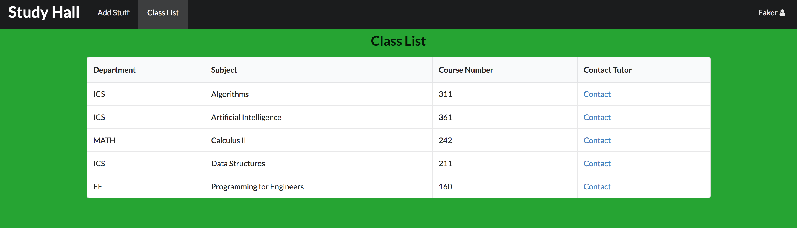
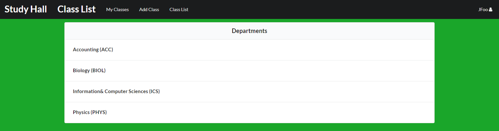
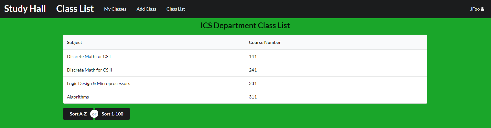
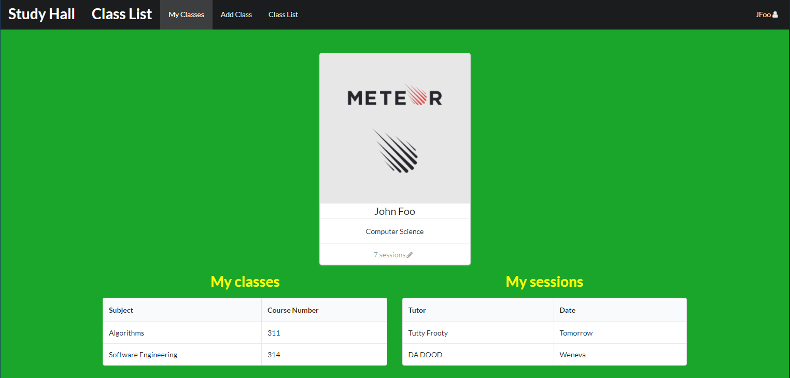
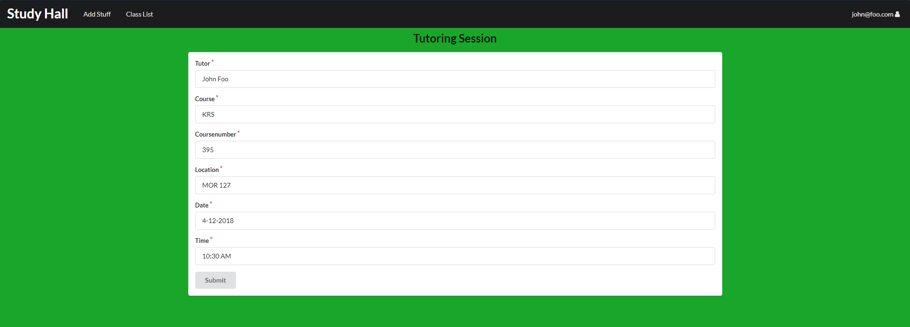
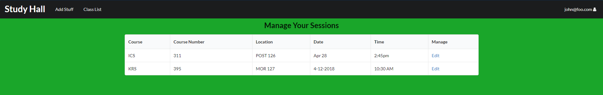

# Study Hall

Students have many obligations in addition to their studies. Many may not have the time to seek out the help they need with their classes. Office hours are sometimes too short, don't fit in the student's schedule, or are simply not enough. Study Hall aims to solve that problem. 

## Overview

Study Hall is a web application made by students for students. Users can register an account and find tutors leading online study groups for a variety of classes. Tutors can organize large groups to help out numerous students who don't have the time during the day to seek out the help they need. Study Hall also provides an instant messaging system for those looking for more direct one-on-one help. Students also have the ability to meet others in their classes and organize private study groups for their courses. 

[Here is a link to our deployed web page](http://studyhall.meteorapp.com).

## User Guide

#### [Landing Page](http://studyhall.meteorapp.com/#/)

From the landing page, the user can login or register an account on Study Hall. This allows them to find tutoring sessions offered by tutors from specific departments and classes. 

#### [My Class List](http://studyhall.meteorapp.com/#/list)

In the users class list, the user may keep track of all the classes they are currently taking. Users can also contact tutors that are currently hosting teaching sessions for those specific classes to plan about sessions they could attend.

#### [Class List](http://studyhall.meteorapp.com/#/ClassList)

The class list page shows users all the currently available sessions for specific departments. When clicking on any of the departments on this page, it will lead to a specific page with sessions only for classes from that department.

We will look to keep the information of the listed classes concise since users will probably know what they are looking for. We will add options to allow users to search classes and filter them by department or number.  

#### [User Home Page](http://studyhall.meteorapp.com/#/userhome)

The user home page will act like the profile page of the user on the website. Here, the user can see the classes they've stated they enrolled in, as well as simple information on sessions they have currently signed up for.

#### [Creating a Tutoring Session](http://studyhall.meteorapp.com/#/create-session)

For verified tutors, they may use this page to create sessions for specific classes with specified dates, times, and locations. Tutors can create sessions whenever and wherever they can that will help out students that need extra tutoring for classes.

#### [Manage Tutoring Sessions](http://studyhall.meteorapp.com/#/manage-session)

If a tutor has created a session, this page lists all the sessions that the tutor is currently going to attend and teach. From here, the tutor may change any relevant information about his/her tutoring sessions to keep information up to date by using the edit their session.

## Community Feedback

"_The site offers a nice service for those who need extra help outside of office hours/those who can't attend them. The amount of departments seem really limited right now. Also the navbar looks strange with Study Hall and Class List being the same size_" - Nick Izawa

"_I'd have to say I really like the idea that anyone can tutor other students whenever they want. As of right now, I'm not sure what some of the pages do, such as the specific class lists. It's a pretty cool idea, though._" - Tyler Young

"_This site can be very helpful for the future and help students get the grades they want to achieve. I don't see any tutors listed right now, I hope to see an example of tutors, otherwise this project looks great and is on the right track._" - Neel Kotak 

"_This is a great app that actually can be used in the future. I hope that you all continue to work on it after this class because it is very helpful. I personally have a busy schedule with work as well and I can't make most office hours. I usually am free at night and having these tutors can really help me. Some tips would be to add more classes._" - Gary Wong 

"_I enjoyed looking at your site, but I believe that you can add more creativity to it. For example more pictures and changing the color to something more appealing. I like all the different pages and how organized it is._" - Yujin Kim 

"_From looking at your site, their is a lot of potential. I like the organization of everything, but it is bland right now. Their should be different colors, pictures, etc. Overall though good app and a great idea._" - Carson Miller

## Developer Guide

First, [install meteor](https://www.meteor.com/install).

Go to the Github page for Study Hall [here](https://github.com/study-hall/study-hall) and fork the repository. You can then clone the forked repository to your computer.

From inside a shell, change directories to the /study-hall/app folder and run:

`meteor npm install`

to install the required libraries.
Once the libraries are installed, you can run the application by using this command:

`meteor npm run start`

### Milestone 2

[Here](https://github.com/study-hall/study-hall/projects/2) is the link to the GitHub M2 project page.
