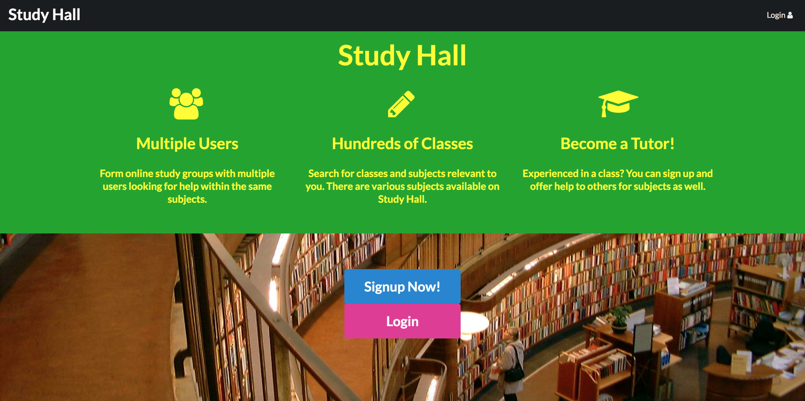

# Study Hall

Students have many obligations in addition to their studies. Many may not have the time to seek out the help they need with their classes. Office hours are sometimes too short, don't fit in the student's schedule, or are simply not enough. Study Hall aims to solve that problem. 

Study Hall is a web application made by students for students. Users can register an account and find tutors leading online study groups for a variety of classes. Tutors can organize large groups to help out numerous students who don't have the time during the day to seek out the help they need. Study Hall also provides an instant messaging system for those looking for more direct one-on-one help. Students also have the ability to meet others in their classes and organize private study groups for their courses. 

## Development

#### Home Page

The first draft of the home page has been created. This is the look that we are trying to achieve when people first visit the site. We want to get the basic point of the app across to them quickly and direct the user to creating an account easily. The color scheme may be changed at a later date.

#### Class Listing

We have a rough mockup of what our class listing will be like. Right now users can add classes onto the site and view a list of them on this page.

We will look to keep the information of the listed classes concise since users will probably know what they are looking for. We will add options to allow users to search classes and filter them by department or number.  

#### Creating a Tutoring Session

There is a basic mockup of the page to allow tutors to create a tutoring session that other users may sign up for. This will add the session to the session collection and allow other pages to get data from the collection.

